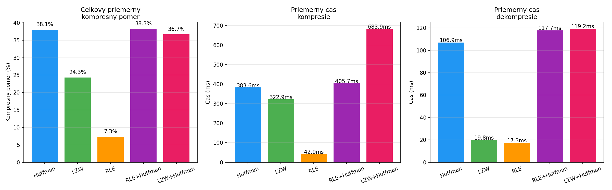
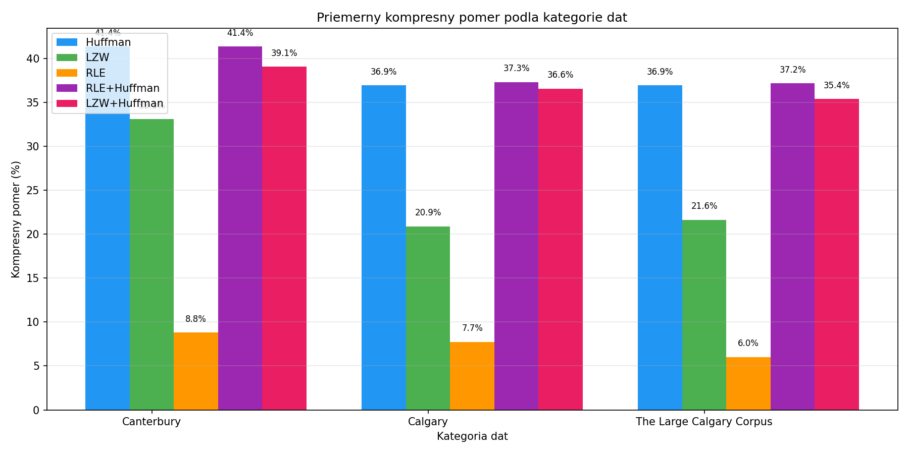
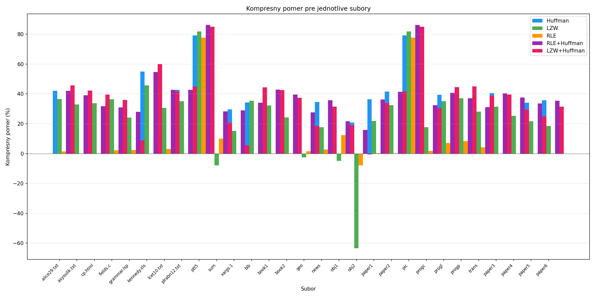
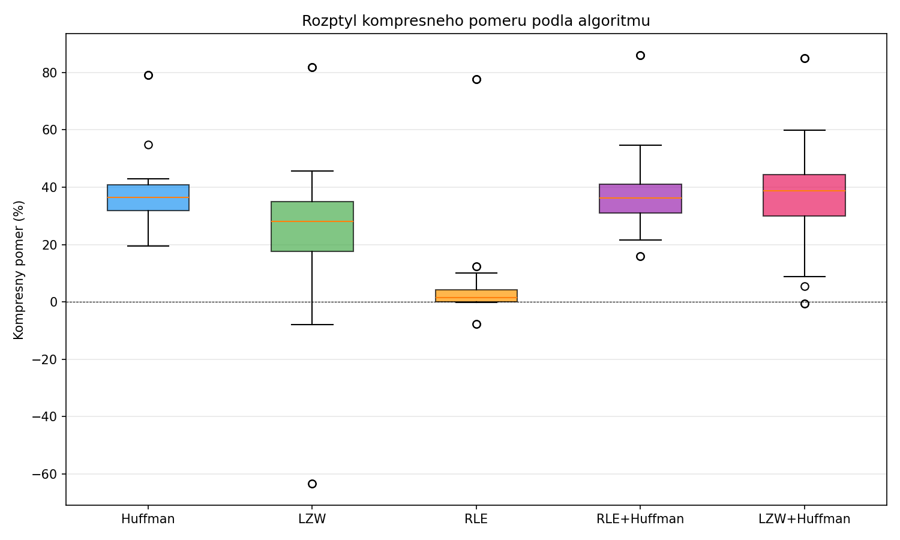
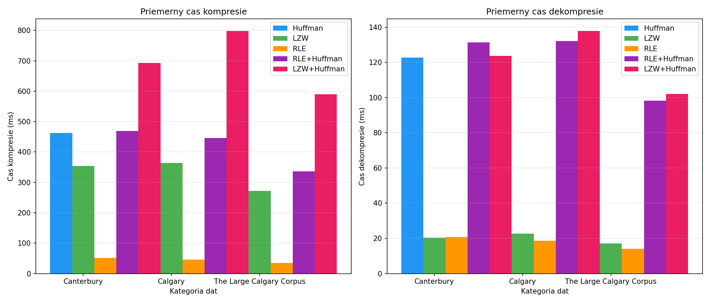
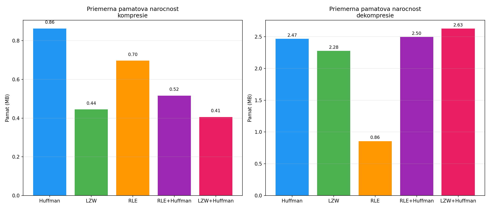

# Porovnanie kompresných algoritmov

Kód k bakalárskej práci o porovnaní bezstratových kompresných algoritmov. Implementácie Huffmanovho kódovania, LZW a RLE v Pythone, plus dva hybridné prístupy (RLE+Huffman a LZW+Huffman). Všetko napísané od základov bez externých kompresných knižníc.

## Štruktúra

```
src/
  huffman.py    - Huffmanovo kódovanie
  lzw.py        - LZW algoritmus
  rle.py        - Run-Length Encoding
  hybrid.py     - kombinácie RLE+Huffman a LZW+Huffman
  benchmark.py  - spustenie testov + export CSV
  visualize.py  - grafy z výsledkov

results/
  benchmark_results.csv  - surové namerané hodnoty
  *.png                  - grafy
```

## Spustenie

Skript predpokladá testovacie súbory v adresári `data/` rozdelené na `Canterbury Corpus`, `The Standard Calgary Corpus` a `The Large Calgary Corpus` (Canterbury a Calgary corpora sú voľne dostupné na stránkach projektov).

```
pip install psutil pandas matplotlib numpy
python src/benchmark.py
python src/visualize.py
```

Benchmark na každý súbor a každý algoritmus spustí 15 opakovaní a zapíše priemer a smerodajnú odchýlku. Overenie integrity pomocou SHA-256 prebieha pri každom opakovaní - ak sa dekomprimované dáta nezhodujú s pôvodnými, test spadne.

## Výsledky

Testované na 29 súboroch z Canterbury a Calgary corporov (spolu 2,175 meraní).

**Priemerný kompresný pomer a rýchlosť**



**Kompresný pomer podľa kategórie dát** - Canterbury obsahuje viac textu a HTML, Calgary väčší podiel binárnych a štruktúrovaných súborov.



**Kompresný pomer pre jednotlivé súbory** - rozdiely medzi algoritmami sú najvýraznejšie na binárnych faxových obrazoch (ptt5, pic) a na objektovom kóde (obj2), kde LZW súbor naopak zväčší.



**Rozptyl kompresného pomeru** - ukazuje, ako veľmi sa výsledky jednotlivých algoritmov líšia v závislosti od typu vstupu. LZW má najväčší rozptyl (od -63 % po 82 %), Huffman naopak najmenší.



**Priemerný čas kompresie a dekompresie**



**Pamäťová náročnosť**



## Poznámky k implementácii

- LZW používa fixné 16-bitové kódy a slovník obmedzený na 4096 záznamov. Produkčné implementácie (napr. gzip) používajú variabilnú dĺžku kódov a reset slovníka, čo dosahuje lepšie pomery, ale skomplikuje dekompresor.
- Huffman reprezentuje bitové kódy ako textové reťazce znakov `0` a `1`. V Pythone je to čitateľnejšie, v C/C++ by sa samozrejme pracovalo priamo s bitovými operáciami.
- RLE používa escape byte `0xFF` na rozlíšenie kódovaných rún od surových dát. Minimálna dĺžka runy je 3, kratšie sa nekódujú (pridali by overhead).
- Hybridy fungujú reťazením výstupov - najprv RLE alebo LZW, potom Huffman na výstupe prvej fázy.
